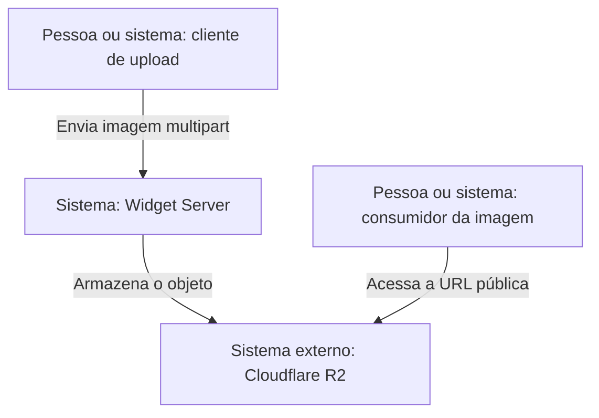
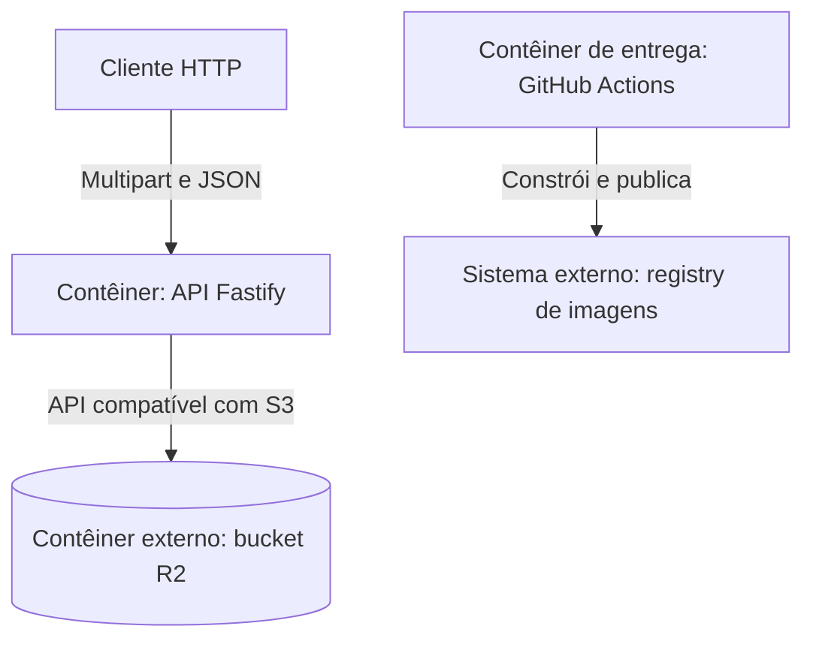
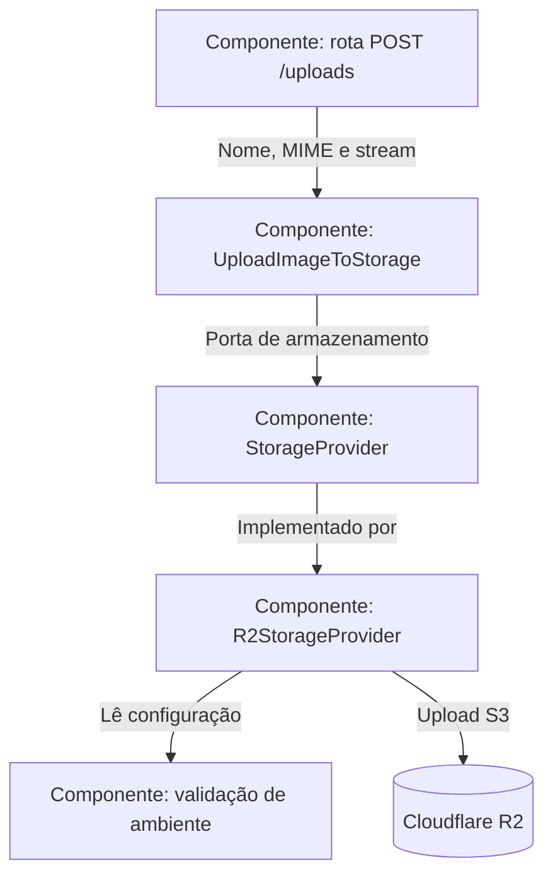
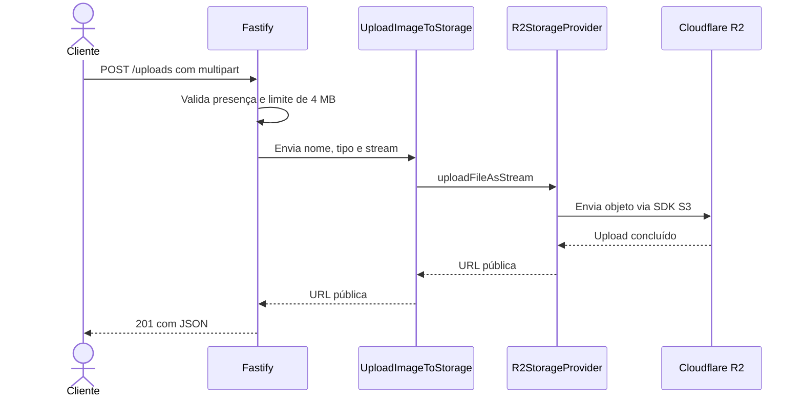

# Widget Server — C4 Model

[README](../../README.md) · [Português](#português) · [English](#english)

Documentação baseada no código do repositório em 20 de setembro de 2026.  
Architecture documentation based on the repository code as of September 20, 2026.

## Português

### Nível 1 — Contexto do sistema

### Nível 2 — Contêineres

### Nível 3 — Componentes da API

### Fluxo principal — upload

## English

### System context

An HTTP client uploads an image to Widget Server. The service stores that image in Cloudflare R2, and consumers later access it through the public R2 URL.

### Containers and components

The Fastify API owns the HTTP and multipart boundary. The upload use case depends on the `StorageProvider` port rather than directly on the vendor SDK. `R2StorageProvider` is the current adapter and reads validated environment configuration.

### Key decisions and boundaries

- Files are streamed instead of being fully buffered by the application.
- The storage contract keeps the use case independent from Cloudflare R2.
- The configured 4 MB limit protects basic resource usage, but it is not a complete abuse-control mechanism.
- The bucket and image registries are external systems with independent access policies.
- Deployment secrets must never be copied into source files or container layers.

## Evolution notes

Add authentication, rate limiting, MIME and extension allowlists, unique object keys, malware scanning, automated tests and one consolidated CI/CD pipeline before production use.
